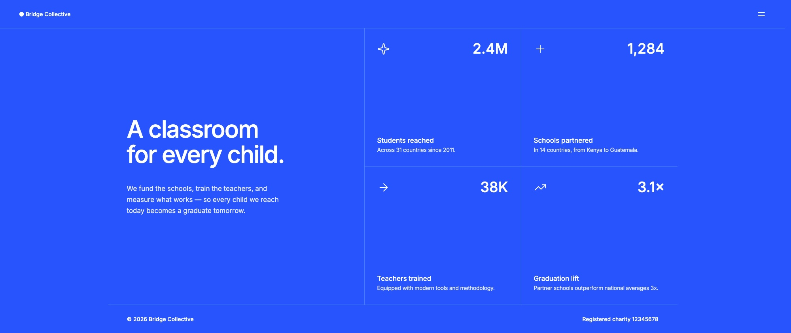

# Frontend Mentor - Grid landing page solution

This is a solution to the [Grid landing page challenge on Frontend Mentor](https://www.frontendmentor.io/challenges/grid-landing-page). Frontend Mentor challenges help you improve your coding skills by building realistic projects.

## Table of contents

- [Overview](#overview)
  - [The challenge](#the-challenge)
  - [Screenshot](#screenshot)
  - [Links](#links)
- [My process](#my-process)
  - [Built with](#built-with)
  - [What I learned](#what-i-learned)
  - [Continued development](#continued-development)
  - [Useful resources](#useful-resources)
  - [AI Collaboration](#ai-collaboration)
- [Author](#author)
- [Acknowledgments](#acknowledgments)

## Overview

### The challenge

Users should be able to:

- View the optimal layout for the page depending on their device's screen size
- See hover and focus states for all interactive elements on the page
- Open and close the navigation menu at any screen size (optional JavaScript)

### Screenshot

### Links

- Solution URL: [github.com/kaili-kameoka/challenge-grid-landing-page-vanilla](https://github.com/kaili-kameoka/challenge-grid-landing-page-vanilla)
- Live Site URL: [kaili-kameoka.github.io/challenge-grid-landing-page-vanilla](https://kaili-kameoka.github.io/challenge-grid-landing-page-vanilla/)

## My process

### Built with

- Semantic HTML5 markup
- CSS custom properties
- CSS Grid
- Flexbox
- Mobile-first workflow
- BEM naming convention
- Progressive enhancement — the page is static HTML; JavaScript only collapses the menu
- [TypeScript](https://www.typescriptlang.org/)
- [Vite](https://vite.dev/) - Build tool

### What I learned

The mockup shows the mobile menu sliding in from the right with the page content darkened behind it, but it assumes a viewport no wider than the desktop breakpoint. On an ultrawide monitor, a contained header put the menu toggle somewhere in the middle of the screen, and only the container dimmed when the menu opened, which read as if part of the page was still reachable. I moved the header to full viewport width so the logo sits hard left and the toggle hard right. The menu now opens beside the content rather than on top of it, and the overlay covers everything it is meant to block.

The larger lesson was that a rendered page can be correct and still be wrong. The generated markup wrapped the stat blocks in `<article>` and labeled them with `<h2>`. Identical in the browser, but it gave VoiceOver a misleading document outline: four top-level sections that were not sections, and headings for what are really just labels. I had the articles changed to divs and the headings to paragraphs. Nothing about the visual output would have flagged that.

### Continued development

The menu links (About, Our Work, Partners, Annual Report, Donate) are in-page anchors with nothing to anchor to, which is what keeps this a demo rather than a finished site. The next step is building that content out, either as sections on this page or as separate pages. I have not decided which yet, and the choice changes the menu behavior: in-page anchors and real page navigation need different handling for moving focus and for closing the menu.

### Useful resources

None. I went straight to AI for the build and VoiceOver for the audit.

### AI Collaboration

I did not write a line of this code. That was deliberate. I am working out a workflow where I stay in control of the decisions while the implementation moves quickly, and this challenge was a test of how far that can go on a static layout. After 15+ years of writing CSS, I am not particular about how a layout gets typed out. I can read the result in a browser and direct corrections when it is off.

What the challenge clarified is where the line falls. The two things AI could not decide for me were the ultrawide header and the semantic corrections after the VoiceOver pass. Accessibility is not a property of the code. It is whether someone using assistive tech can actually operate the thing, and the only way to know that is to open it and try. The AI produced markup that passed visual inspection and failed that test.

## Author

- Website - [kaili.me](https://kaili.me)
- Frontend Mentor - [@kaili-kameoka](https://www.frontendmentor.io/profile/kaili-kameoka)

## Acknowledgments
